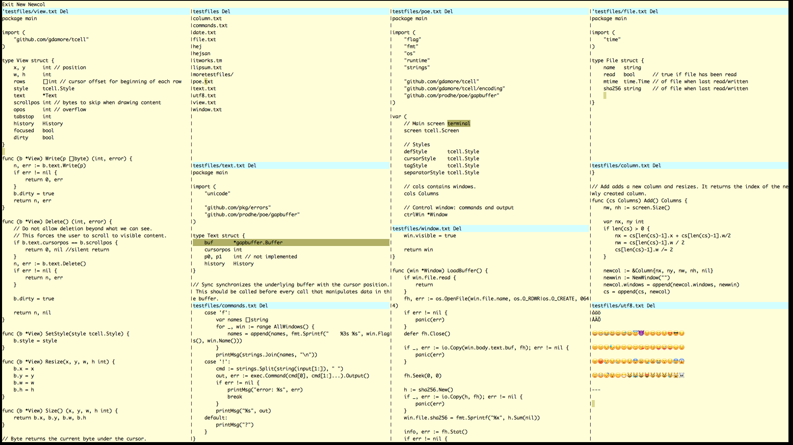

# poe

My very own [acme](http://acme.cat-v.org/)-inspired terminal text editor.

Because everything else is Not Invented Here.

## Install

You need [Go](https://golang.org/). Then:

`go get -u github.com/prodhe/poe`

Binary distribution may or not be available. As of now, the source should do just fine.

## Usage

`^Q` exits.

Everything is text and everything is editable. There are two ways to interact with text, `Run` or `Open`.

`Open` (`^O` or right-click) will assume the selected text is a file or a directory and will open a new window listing its content. If none is found, it does nothing.

`Run` (`^R` or middle-click) interprets the text as a command, which can be an internal poe command like `New` or `Del`. If none is found, it does nothing.

`^S` saves current buffer to disk.

### Commands

`New` opens an empty window.

`Newcol` creates a new column with a new window.

`Del` closes current window. If it is the last window, the program will exit.

`Exit` closes all windows and exits the program.

`!date` executes `date` as a shell command and presents its output in the message window named `+poe`.

## Bugs

Endless. As of now, it is in constant development and things may (and will) break unannounced. Do not use for production.
